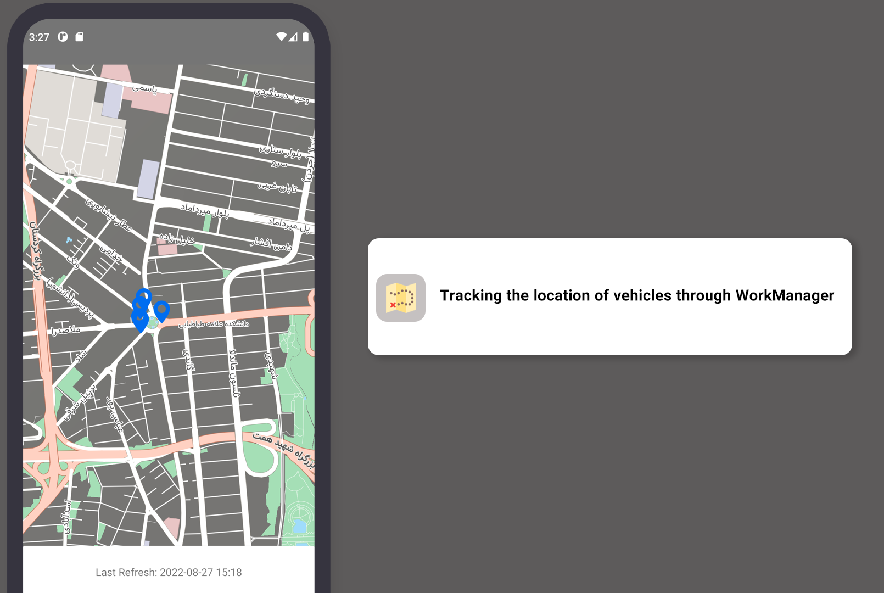

# A sample clean mvvm application that receives vehicle information from the web service every 15 minutes by Work Manager and syncs the database based on it. The data cached by ROOM updates the vehicle's location on the map after each change
  

- [Coroutines](https://developer.android.com/kotlin/coroutines) and flows
- [Room Persistence Library](https://developer.android.com/training/data-storage/room "Room Persistence Library")
- Dependency Injection With Hilt Library.
- Clean Architecture approach.
- Neshan Maps SDKs 

## **Replace your API URL with BASE_URL* 

## Screenshot

 
